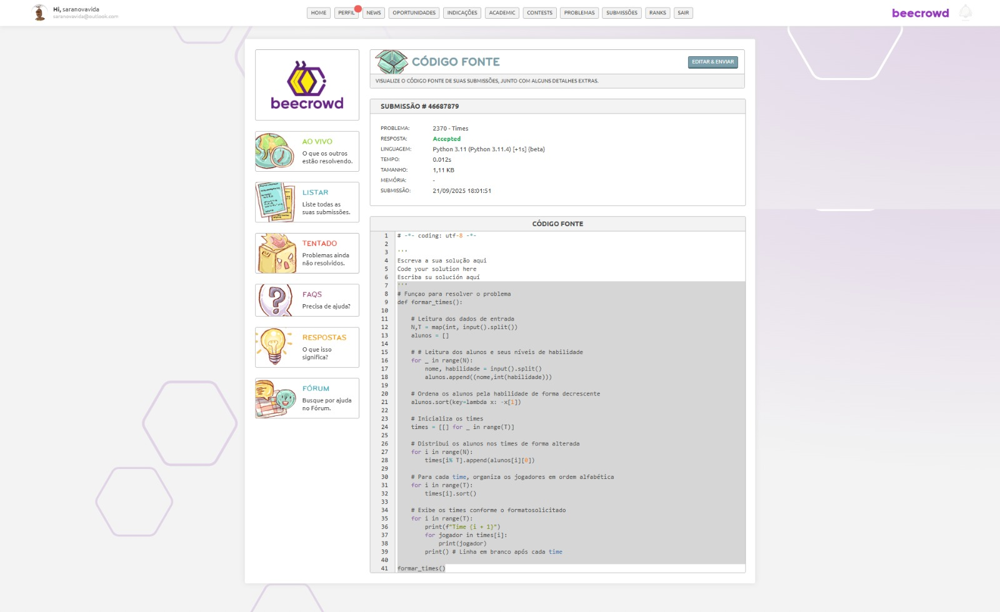
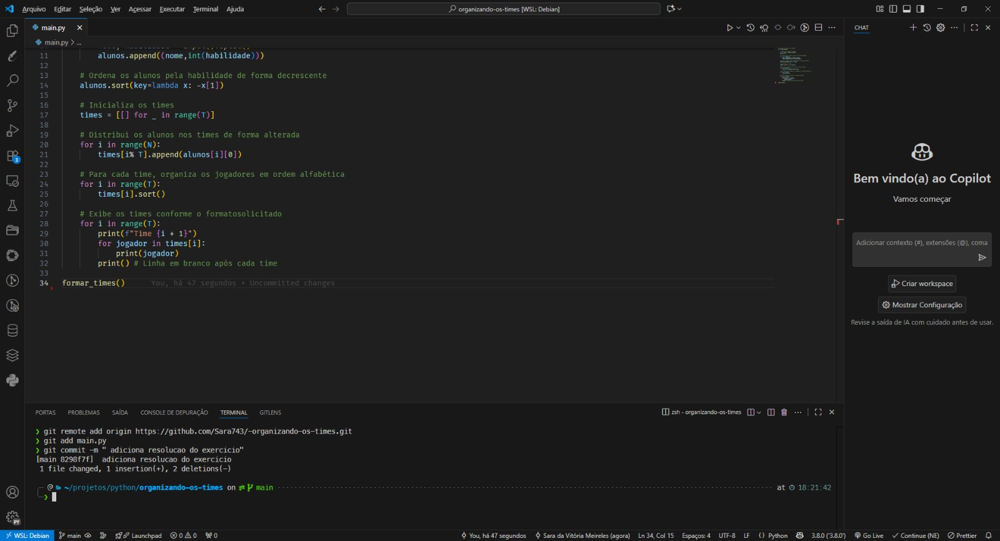

# LINK PARA O REPOSITORIO 

https://github.com/Sara743/-organizando-os-times

# Passos para Desenvolvimento

## Passo 1 - Resolução do Problema

## Passo 2 - Submetendo solução 

## Passo 3 - Submetendo para GITHUB

### 1. Criando repositorio

### 2. Commitando Codigo

#### 2.1  Comando GIT INIT

#### 2.2  Comando GIT ADD

#### 2.3  Comando GIT COMMIT 

### 2.4 Comando GIT REMOTE ADD 

### 2.4 Comando GIT PUSH

